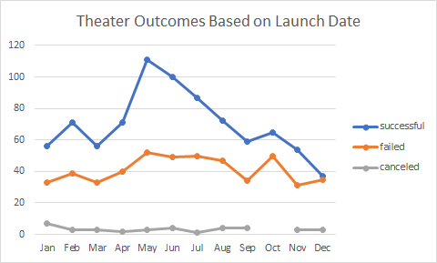
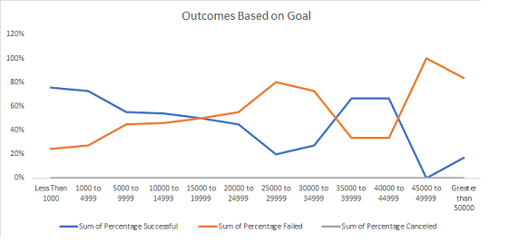

# Kickstarter-Analysis

## Overview of Project
Kickstarter is a global crowdfunding platform focused on creativity. It exists to help bring creative projects to life. A home for film, music, art, theater, games, comics, design, and photography. Louise, a playwright, Kickstarter campaign for her play “Fever” came close to its fundraising goal in a short amount of time. This analysis will show how different theater campaigns fared in relation to their launch dates and their funding goals. 

### Purpose
The purpose of this data analysis was performed on just over several thousand crowdfunding projects to uncover campaign trends as shown in Chart.1: Theater Outcomes Based on Launch Date and Chart.2: Outcomes Based on Goal. 

## Analysis and Challenges

### Analysis of Outcomes Based on Launch Date

### Analysis of Outcomes Based on Goals

### Challenges and Difficulties Encountered
While the uncovered trends show outcomes of just over 1,300 theater projects, this data is challenged by both a small dataset and the unknown types of plays to show a clearer picture. Since we don’t know what is reasonable to obtain, what we can see from the data provided, the month of May would be the best for a successful theater campaign. 

## Results
Upon further analysis, the most campaigns funded at or above 100% were hosted during the months of May and June whereas October shows the most failed campaigns. Outcomes based on goal shows, the highest percentage of success is at a range greater than or equal to $45,000 and less than or equal to $49,999. 

We can assume, the more data to measure, could give us a full picture to learn the scope of theater funded campaigns on Kickstarter. The theater outcomes based on launch date and goals suggest recommendations for future inquiry with a larger data set, type of theater, and type of play.  
